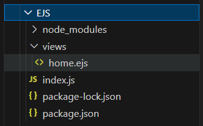
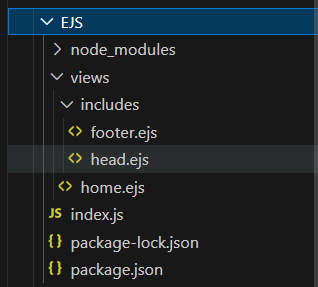

<h1 align="center">Embedded JavaScript templates</h1>
<br/>


## Using EJS

```js
const express = require("express");
// no need to require EJS Express automatically require EJS
const app = express();
const port = 8080;

app.set("view engine", "ejs");

app.listen(port, () => {
    console.log("Listening...");
});

app.get("/", (req, res) => {
    res.render("home.ejs");
});
```
<br/>

`home.ejs` directory location:



## Views Directory Error

If server is starting from a differnt directety 

Then it trys to find 'views' directry in the server started directry

Then this error shows `Error: Failed to lookup view "home.ejs" in views directory "C:\Users\azzim\Desktop\Azim\Code\Web-Develpment\Back-end\views"`

To fix this Use this:

```js
const path = require("path");
app.set("views", path.join(__dirname, "/views"));
```

## Interpolation Syntax

Interpolation refers to embedding expressions into marked up text.

`home.ejs`

```html
<h1>
    <%= "azim".toUpperCase() %>
</h1>
```
> Like this JS can be used inside EJS


## Passing data to EJS

* `index.js`
    ```js
    app.get("/", (req, res) => {
        let randNum = Math.floor(Math.random() * 10); // Dummy database
        // res.render("home.ejs", { num: randNum });
        res.render("home.ejs", { randNum });
    });
    ```

* `home.ejs`
    ```html
    <h1>
        <%= randNum %>
    </h1>
    ```

## Conditional Statements in EJS

* `home.ejs`
  ```html
    <h1>
        <%= randNum %>
    </h1>

    <% if(randNum==0) {%>
        <h2>You get 0 </h2>
    <% } %>
    ```

## Loops in EJS

* `home.ejs`
  ```js
  <% for(let i = 0; i <= 5; i++) {%>
      <h1>Azim</h1>
  <% } %>
  ```

## Includes

Includes are sub-templets

Example:

* `home.ejs`
  ```js
  <%- include("includes/head.ejs") %>
  ```

> Basically in this example html head is inside `head.ejs`

