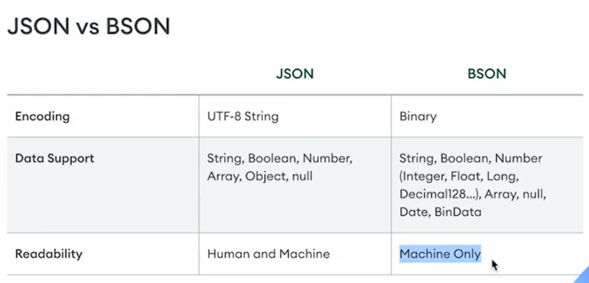

<h1 align="center">MongoDB</h1>
<br/>


## Basics

To run MongoDB sell
```sh
mongosh
```

> Document: Mongo stores data in form of documents (BSON docs)
 
> Collection: MongoDB stores documents in collections.

> MongoDB use BSON Data AKA Binary JSON.



Show Dbs
```sh
test> show dbs
admin   40.00 KiB
config  72.00 KiB
local   80.00 KiB
```

To create & use a new database called "azim"
```sh
test> use azim
switched to db azim
```

## INSERT in DB

To see collections

```sh
show collections
```

To make a new collection / insert one

```sh 
db.about.insertOne({ name: "Azim" });
```

To see a collection data

```sh
db.about.find();
```

To insert many

```sh
db.about.insertMany([{name: "Azim3"},{name: "Azim4"}]);
```

> If a collection does not exist, MongoDB creates the collection when you first store data for that collection.


## FIND in DB

```sh
db.about.find(); // Find everything
```

For specific queries

```sh
db.about.find({name: "Azim"}); // Find many
db.about.findOne({name: "Azim", city: "Cuttack"}); // Find one
```

> The `find()` method returns a cursor or reference to the original data, while the `findOne()` method returns the original data itself.

## Query Operators

### Comparison

| Name | Description |
|------|-------------|
| $eq  | Matches values that are equal to a specified value. |
| $gt  | Matches values that are greater than a specified value. |
| $gte | Matches values that are greater than or equal to a specified value. |
| $in  | Matches any of the values specified in an array. |
| $lt  | Matches values that are less than a specified value. |
| $lte | Matches values that are less than or equal to a specified value. |
| $ne  | Matches 011 values that are not equal to O specified value. |
| $nin | Matches none of the values specified in an array. |

### Logical

| Name | Description |
|------|-------------|
| $and | Joins query clauses with a logical AND returns all documents that match the conditions of both clauses. |
| $not | Inverts the effect of a query expression and returns documents that do not match th query expression.|
| $nor | Joins query clauses with a logical NOR returns all documents that fail to match. |
| $or | Joins query clauses with a logical OR returns all documents that match. |

Q. Find students where marks > 75

```sh
azim> db.about.find({mark: {$gt: 75}});
```

Q. Find students who live in cuttack or pune

```sh
azim> db.about.find({city: {$in: ["cuttack","pune"]}});
```

Q. Find students who scored > 35 or live in pune

```sh
db.about.find({$or: [{mark: {$gt: 36}},{city: "pune"}]});
```

## UPDATE in DB

### Update Operators
 * $addFie1ds
 * $set
 * $project
 * $unset
 * $replaceRoot
 * $replaceWith

> SYNTX>> db.coIIection.updateOne( filter , update, options )

To update one

```sh
db.users.updateOne({name: "Alam"}, {$set: {mark: 99}})
```

| Name | Description |
|------|-------------|
| db.collection.updateMany() | Update all documents that match a specified filter. Replaces at most a single document that match a specified filter even though |
| db.collection.replaceOne() | multiple documents may match the specified filter. |

To replace many

```sh
db.users.updateMany({mark: 99}, {$set: {name: "Azim"}});
```

To replace one 

```sh
db.users.replaceOne({name: "IDK"}, {name: "Azim", age: 20, mark: 99});
```

## Nesting

```sh
db.collection.findOne( {"performance.marks" : 88} )
```

> for find nesting objects use key in `"string"`

## DELETE in DB

To delete one

```sh
db.users.deleteOne({name: "Aziz"});
```

To delete many

```sh
db.users.deleteMany({mark: 99});
```

To delete a collection

```sh
db.collection.drop();
```

To delete a database

```sh
db.dropDatabase();
```