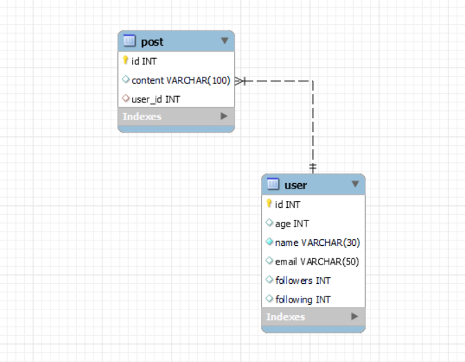

<h1 align="center">Structured Query Language</h1>
<br/>


[SQL with Node JS](#node)

For using SQL in CMD 👇
  ```sh
  mysql -u root -p
  ```

## Database Queries

Creating a database ⬇️

```sql
CREATE DATABASE db_name;
```
```sql
CREATE DATABASE IF NOT EXISTS db_name;
```

Deleting a database ⬇️

```sql
DROP DATABASE db_name;
```
```sql
DROP DATABASE IF EXISTS db_name;
```

Show database ⬇️

> Befor using `SHOW TABLES` first `USE` the database

```sql
SHOW DATABASES;
```
```sql
SHOW TABLES;
```

## Data Types


## Table Queries

* Create
* Insert
* Update
* Alter
* Truncate
* Delete
  
## Constraints

Rules for data in the table

* NOT NULL ➡️ columns cannot have a null value
* UNIQUE ➡️ all values in column are different
* DEFAULT ➡️ sets the default value of a column
  * ```sql
    salary INT DEFAULT 25000,
    ```
* CHECK ➡️ it can limit the values allowed in a column
  * ```sql
    CONSTRAINT age_check CHECK (age >= 18 AND city="Delhi"),
    ```
* PRIMARY KEY ➡️ makes a column unique & not null but used only for one
  * ```sql
    CREATE TABLE temp (
      id INT NOT NULL,
      PRIMARY KEY(id)
    );
    ```
* FOREIGN KEY ➡️ prevent actions that would destroy links between tables
  * ```sql
    CREATE TABLE temp (
      cust_id INT,
      FOREIGN KEY (cust_id) REFERENCES customer(id)
    );
    ```
### More about PRIMARY KEY & FOREIGN KEY

#### What are Keys ?

Ans: Keys are special columns in the table

#### Primary Key

It is a column (or set of columns) in a table that uniquely identifies each row. (a unique id) There is only 1 PK & it should be NOT null.

#### Foreign Key

A foreign key is a column (or set of columns) in a table that refers to the primary key in annother table

FKs can have duplicate & null values.

There can be multiple FKs.

## Insert into Table

Insert into Table

```sql
INSERT INTO user
(id, age, name, email, followers, following)
VALUES
(1, 20, "Azim", "azim@azim.com", 1000, 10);
```
## Select Command

Selects & Show data from the DB

```sql
SELECT id, name, email FROM user;
SELECT * FROM user;
SELECT DISTINCT age FROM user;
```

> `DISTINCT` is uswed so show all unique values.


<br/>


TABLE EXAMPLE:

```sql
CREATE DATABASE IF NOT EXISTS instagram;
USE instagram;

CREATE TABLE user (
	id INT PRIMARY KEY,
    age INT,
    name VARCHAR(30) NOT NULL,
    email VARCHAR(50) UNIQUE ,
    followers INT DEFAULT 0,
    following INT,
    CONSTRAINT CHECK (age >= 18)
);

INSERT INTO user
(id, age, name, email, followers, following)
VALUES
(1, 20, "Azim", "azim@azim.com", 1000, 10);

CREATE TABLE post (
	id INT PRIMARY KEY,
    content VARCHAR(100),
    user_id INT,
    FOREIGN KEY (user_id) REFERENCES user(id)
);

INSERT INTO post
(id, content, user_id)
VALUES
(2, "Hello, World", 1);

SELECT id, content, user_id FROM post;
SELECT * FROM user;
SELECT DISTINCT age FROM user;
```

<br/>

> To visualize tables use `Ctr + R` ⬇️



## Where Clause & Limit Clause

To define some conditions

```sql
SELECT name, followers
FROM user
WHERE (followers >= 500)
LIMIT 10;
```

> All kind of Operators can be used in `WHERE` Keyword<br/>including: Arithmetic, Comparison, Logical & Bitwise

> `LIMIT` limits the output


## Order by Clause

To sort in ascending `ASC` or descending order `DESC`

```sql
SELECT name, followers
FROM user
ORDER BY followers DESC;
```

> Deafult order is `ASC`

## Aggregate Functions

Aggregate functions perform a calculation on a set of values, and return a single value.

* COUNT( )
* MAX( )
* MIN( )
* SUM( )
* AVG( )

EXAMPLE:

```sql
SELECT  max(followers)
FROM user;
```

## Group by Clause 

Groups rows that have the same values into summary rows.

It collects data from multiple records and groups the result by one or more column.

```sql
SELECT  age, max(followers)
FROM user
GROUP BY age;
```

> Generally we use group by with some aggregation function.


## Having Clause

Similar to Where i.e. applies some condition on rows.

But it is used when we want to apply any condition after grouping.

```sql
SELECT  age, max(followers)
FROM user
GROUP BY age
HAVING max(followers) > 200;
```

> WHERE is for the table, HAVING is for a group

> Grouping is necessary for HAVING

## General Order

```js
SELECT column(s)
FROM table_name
WHERE condition
GROUP BY column(s)
HAVING condition
ORDER BY column(s) ASC;
```

## Update Queries

To update existing rows

```sql
UPDATE user
set followers = 0
WHERE age < 18;
```
Befor run this:

```sql
SET SQL_SAFE_UPDATES = 0;
```

## Delete Queries

To delete existing rows.

```sql
DELETE from user
WHERE age = 20;
```

## Alter Queries

To change the schema OR column

* ADD Column

  ```sql
  ALTER TABLE user
  ADD COLUMN city VARCHAR(30);
  ```
* DROP Column

  ```sql
  ALTER TABLE user
  DROP COLUMN city;
  ```
* RENAME Table

  ```sql
  ALTER TABLE user
  RENAME TO my_user;
  ```
* CHANGE Column (rename)

  ```sql
  ALTER TABLE user
  CHANGE COLUMN id user_id INT;
  ```
* MODIFY Column (modify datatype / constraint)

  ```sql
  ALTER TABLE user
  MODIFY name VARCHAR(50);
  ```

## Table Queries

to delete tablels data

```sql
TRUNCATE TABLE user;
```

> TRUNCATE will make the table empty.

> But DROP delete the table.


<br/><br/><br/><hr/>
<h1 id="node" align="center">SQL with Node JS</h1>

## Ways to write SQL

1. Using >>  `MySQL Workbench`

2. Using >> `MySQL 8.0 Command Line Client`

3. Using >> `mysql2 npm package`
  
4. Using >> `.sql file` 

## Using mysql2 npm package

5. First install `sql2` npm 
   
   ```sh
   npm i mysql2
   ```
6. then use this code
   ```js
   import mysql from 'mysql2/promise';
   
   // Create the connection to database
   const connection = await mysql.createConnection({
     host: 'localhost',
     user: 'root',
     database: 'azim_app',
     password: '7786',
   });
   
   // A simple SELECT query
   try {
     const [results, fields] = await connection.query(
       'SHOW TABLES'
     );
   
     console.log(results); // results contains rows returned by server
     console.log(fields); // fields contains extra meta data about results, if available
   } catch (err) {
     console.log(err);
   }
   
   connection.end();
   ```

## Using .sql file

1. Create `.sql` file & write sql code inside it

2. Open `MySQL 8.0 Command Line Client`

3. Command >> `SOURCE` then and drop example.sql file
   ```js
   mysql> SOURCE C:\Users\azzim\Desktop\example.sql
   Query OK, 0 rows affected (0.03 sec)
   ```

## INSERT User

```js
import mysql from "mysql2/promise";

// Create the connection to database
const connection = await mysql.createConnection({
  host: "localhost",
  user: "root",
  database: "azim_app",
  password: "7786",
});

let query = "INSERT INTO user (id, name, email, password) VALUES ?";
let user = [
  [8, "Axim", "axim@tech.com", "0233"],
  [9, "Alam", "alam@tech.com", "1723"],
  [10, "Aziz", "aziz@tech.com", "1233"]
];

// A simple SELECT query
try {
  const [results, fields] = await connection.query(query, [user]);

  console.log(results); // results contains rows returned by server
  console.log(fields); // fields contains extra meta data about results, if available
} catch (err) {
  console.log(err);
}
connection.end();

// Example of SQL with Node JS
```